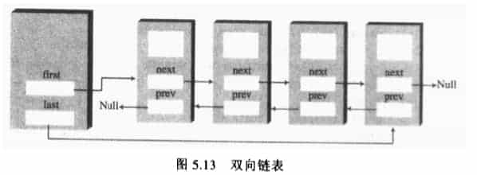

# LinkList源码分析


## 特点
LinkedList：底层数据结构是链表，查询慢，增删快。线程不安全，效率高  添加了的功能 添加，删除，获取开头或者结尾	
## 开始分析源码
### 1、先看继承关系
``` java
public class LinkedList<E>
    extends AbstractSequentialList<E>
    implements List<E>, Deque<E>, Cloneable, java.io.Serializable
```

### 2、先看成员变量

``` java
    // 记录集合的长度
    transient int size = 0;

    // 链表头节点
    /**
     * Pointer to first node.
     * Invariant: (first == null && last == null) ||
     *            (first.prev == null && first.item != null)
     */
    transient Node<E> first;

    // 链表尾节点
    /**
     * Pointer to last node.
     * Invariant: (first == null && last == null) ||
     *            (last.next == null && last.item != null)
     */
    transient Node<E> last;
```
### 3、构造函数并没有干什么

```
    /**
     * Constructs an empty list.
     */
    public LinkedList() {
    }

```

### 4、介绍里面的链表关联结构体 双向链表


```
    private static class Node<E> {
        //当前的节点
        E item;
        //下一个节点
        Node<E> next;
        //上一个节点
        Node<E> prev;

        Node(Node<E> prev, E element, Node<E> next) {
            this.item = element;
            this.next = next;
            this.prev = prev;
        }
    }
```

### 5、增

``` java

    public boolean add(E e) {
        linkLast(e);
        return true;
    }
    
    public void addFirst(E e) {
        linkFirst(e);
    }
    
    public void addLast(E e) {
        linkLast(e);
    }
    
    public void push(E e) {
        addFirst(e);
    }
    /**
     * Links e as first element.
     */
    private void linkFirst(E e) {
        final Node<E> f = first;
        final Node<E> newNode = new Node<>(null, e, f);
        first = newNode;
        if (f == null) //如果当前的头节点为null 则 尾节点也为插入的节点
            last = newNode;
        else
            f.prev = newNode;
        size++;
        modCount++;
    }
    
    /**
     * Links e as last element.
     */
    void linkLast(E e) {
        final Node<E> l = last;
        final Node<E> newNode = new Node<>(l, e, null);
        last = newNode;
        if (l == null)
            first = newNode;
        else
            l.next = newNode;
        size++;
        modCount++;
    }
    
    //批量添加
    public boolean addAll(int index, Collection<? extends E> c) {
        //检查索引是在范围内
        checkPositionIndex(index);
        //将进来的Collection 都转换为数组
        Object[] a = c.toArray();
        int numNew = a.length;
        if (numNew == 0)
            return false;

        Node<E> pred, succ;
        if (index == size) {
            succ = null;
            pred = last;
        } else {
            succ = node(index);
            pred = succ.prev;
        }

        for (Object o : a) {
            @SuppressWarnings("unchecked") E e = (E) o;
            Node<E> newNode = new Node<>(pred, e, null);
            if (pred == null)
                first = newNode;
            else
                pred.next = newNode;
            pred = newNode;
        }

        if (succ == null) {
            last = pred;
        } else {
            pred.next = succ;
            succ.prev = pred;
        }

        size += numNew;
        modCount++;
        return true;
    }
```

### 6、删


``` java
    public E removeFirst() {
        final Node<E> f = first;
        if (f == null)
            throw new NoSuchElementException();
        return unlinkFirst(f);
    }
    
    public E removeLast() {
        final Node<E> l = last;
        if (l == null)
            throw new NoSuchElementException();
        return unlinkLast(l);
    }
    
    public E pop() {
        return removeFirst();
    }


    /**
     * Unlinks non-null first node f.
     */
    private E unlinkFirst(Node<E> f) {
        // assert f == first && f != null;
        final E element = f.item;
        final Node<E> next = f.next;
        f.item = null;
        f.next = null; // help GC
        first = next;
        if (next == null)
            last = null;
        else
            next.prev = null;
        size--;
        modCount++;
        return element;
    }

    /**
     * Unlinks non-null last node l.
     */
    private E unlinkLast(Node<E> l) {
        // assert l == last && l != null;
        final E element = l.item;
        final Node<E> prev = l.prev;
        l.item = null;
        l.prev = null; // help GC
        last = prev;
        if (prev == null)
            first = null;
        else
            prev.next = null;
        size--;
        modCount++;
        return element;
    }

    /**
     * Unlinks non-null node x.
     */
    E unlink(Node<E> x) {
        // assert x != null;
        final E element = x.item;
        final Node<E> next = x.next;
        final Node<E> prev = x.prev;

        if (prev == null) {
            first = next;
        } else {
            prev.next = next;
            x.prev = null;
        }

        if (next == null) {
            last = prev;
        } else {
            next.prev = prev;
            x.next = null;
        }

        x.item = null;
        size--;
        modCount++;
        return element;
    }
```

### 7、改

```
    public E set(int index, E element) {
        checkElementIndex(index);
        Node<E> x = node(index);
        E oldVal = x.item;
        x.item = element;
        return oldVal;
    }
```
### 8、clear 所有的数据

```
    public void clear() {
        // Clearing all of the links between nodes is "unnecessary", but:
        // - helps a generational GC if the discarded nodes inhabit
        //   more than one generation
        // - is sure to free memory even if there is a reachable Iterator
        //这个循环比较有意思µ
        for (Node<E> x = first; x != null; ) {
            Node<E> next = x.next;
            x.item = null;
            x.next = null;
            x.prev = null;
            x = next;
        }
        first = last = null;
        size = 0;
        modCount++;
    }
```