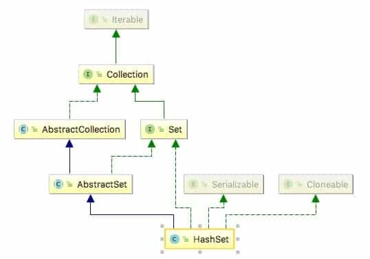
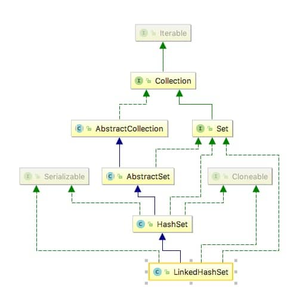

# 一、HashSet源码分析



```
public class HashSet<E>
    extends AbstractSet<E>
    implements Set<E>, Cloneable, java.io.Serializable
```
## 特点
元素是无序的，保持唯一性
### 源码
### 1.构造函数
```
    public HashSet() {
        map = new HashMap<>();
    }
   /**
     * Constructs a new set containing the elements in the specified
     * collection.  The <tt>HashMap</tt> is created with default load factor
     * (0.75) and an initial capacity sufficient to contain the elements in
     * the specified collection.
     *
     * @param c the collection whose elements are to be placed into this set
     * @throws NullPointerException if the specified collection is null
     */
    public HashSet(Collection<? extends E> c) {
        map = new HashMap<>(Math.max((int) (c.size()/.75f) + 1, 16));
        addAll(c);
    }

    /**
     * Constructs a new, empty set; the backing <tt>HashMap</tt> instance has
     * the specified initial capacity and the specified load factor.
     *
     * @param      initialCapacity   the initial capacity of the hash map
     * @param      loadFactor        the load factor of the hash map
     * @throws     IllegalArgumentException if the initial capacity is less
     *             than zero, or if the load factor is nonpositive
     */
    public HashSet(int initialCapacity, float loadFactor) {
        map = new HashMap<>(initialCapacity, loadFactor);
    }

    /**
     * Constructs a new, empty set; the backing <tt>HashMap</tt> instance has
     * the specified initial capacity and default load factor (0.75).
     *
     * @param      initialCapacity   the initial capacity of the hash table
     * @throws     IllegalArgumentException if the initial capacity is less
     *             than zero
     */
    public HashSet(int initialCapacity) {
        map = new HashMap<>(initialCapacity);
    }

    /**
     * Constructs a new, empty linked hash set.  (This package private
     * constructor is only used by LinkedHashSet.) The backing
     * HashMap instance is a LinkedHashMap with the specified initial
     * capacity and the specified load factor.
     *
     * @param      initialCapacity   the initial capacity of the hash map
     * @param      loadFactor        the load factor of the hash map
     * @param      dummy             ignored (distinguishes this
     *             constructor from other int, float constructor.)
     * @throws     IllegalArgumentException if the initial capacity is less
     *             than zero, or if the load factor is nonpositive
     */
     
   //可以看出这个构造函数是留给 LinkedHashSet留下来的
    HashSet(int initialCapacity, float loadFactor, boolean dummy) {
        map = new LinkedHashMap<>(initialCapacity, loadFactor);
    }

```
### 2.成员变量

```
    //可以看到 HashSet底层使用的其实就是HashMap
    private transient HashMap<E,Object> map;

    // 这个对象用来，当HashSet的值
    // Dummy value to associate with an Object in the backing Map
    private static final Object PRESENT = new Object();
```
## 3.函数

```

    /**
     * Returns an iterator over the elements in this set.  The elements
     * are returned in no particular order.
     *
     * @return an Iterator over the elements in this set
     * @see ConcurrentModificationException
     */
    public Iterator<E> iterator() {
        return map.keySet().iterator();
    }

    /**
     * Returns the number of elements in this set (its cardinality).
     *
     * @return the number of elements in this set (its cardinality)
     */
    public int size() {
        return map.size();
    }

    /**
     * Returns <tt>true</tt> if this set contains no elements.
     *
     * @return <tt>true</tt> if this set contains no elements
     */
    public boolean isEmpty() {
        return map.isEmpty();
    }

    /**
     * Returns <tt>true</tt> if this set contains the specified element.
     * More formally, returns <tt>true</tt> if and only if this set
     * contains an element <tt>e</tt> such that
     * <tt>(o==null&nbsp;?&nbsp;e==null&nbsp;:&nbsp;o.equals(e))</tt>.
     *
     * @param o element whose presence in this set is to be tested
     * @return <tt>true</tt> if this set contains the specified element
     */
    public boolean contains(Object o) {
        return map.containsKey(o);
    }

    /**
     * Adds the specified element to this set if it is not already present.
     * More formally, adds the specified element <tt>e</tt> to this set if
     * this set contains no element <tt>e2</tt> such that
     * <tt>(e==null&nbsp;?&nbsp;e2==null&nbsp;:&nbsp;e.equals(e2))</tt>.
     * If this set already contains the element, the call leaves the set
     * unchanged and returns <tt>false</tt>.
     *
     * @param e element to be added to this set
     * @return <tt>true</tt> if this set did not already contain the specified
     * element
     */
    public boolean add(E e) {
        return map.put(e, PRESENT)==null;
    }

    /**
     * Removes the specified element from this set if it is present.
     * More formally, removes an element <tt>e</tt> such that
     * <tt>(o==null&nbsp;?&nbsp;e==null&nbsp;:&nbsp;o.equals(e))</tt>,
     * if this set contains such an element.  Returns <tt>true</tt> if
     * this set contained the element (or equivalently, if this set
     * changed as a result of the call).  (This set will not contain the
     * element once the call returns.)
     *
     * @param o object to be removed from this set, if present
     * @return <tt>true</tt> if the set contained the specified element
     */
    public boolean remove(Object o) {
        return map.remove(o)==PRESENT;
    }

    /**
     * Removes all of the elements from this set.
     * The set will be empty after this call returns.
     */
    public void clear() {
        map.clear();
    }

    /**
     * Returns a shallow copy of this <tt>HashSet</tt> instance: the elements
     * themselves are not cloned.
     *
     * @return a shallow copy of this set
     */
    @SuppressWarnings("unchecked")
    public Object clone() {
        try {
            HashSet<E> newSet = (HashSet<E>) super.clone();
            newSet.map = (HashMap<E, Object>) map.clone();
            return newSet;
        } catch (CloneNotSupportedException e) {
            throw new InternalError(e);
        }
    }
```

# 二、LinkedHashSet



## 1、构造函数

由 继承关系可以看出 LinkedHashSet 是 HashSet的子类，可以看出HashSet留私有的构造函数，是留给LinkedHashSet留下的
```

    public LinkedHashSet(int initialCapacity, float loadFactor) {
        super(initialCapacity, loadFactor, true);
    }

    public LinkedHashSet(int initialCapacity) {
        super(initialCapacity, .75f, true);
    }

    public LinkedHashSet() {
        super(16, .75f, true);
    }

    public LinkedHashSet(Collection<? extends E> c) {
        super(Math.max(2*c.size(), 11), .75f, true);
        addAll(c);
    }
```


