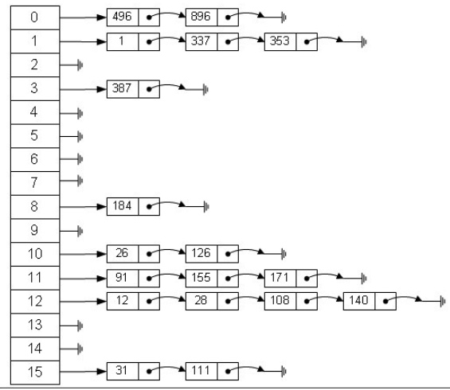

# HashMap 源码分析 

## 先介绍一下 HashMap使用的数据结构


> 基于 Java 1.8


``` java
public class HashMap<K,V> extends AbstractMap<K,V>
    implements Map<K,V>, Cloneable, Serializable {
```


## 1、成员变量

``` java
  /**
     * The default initial capacity - MUST be a power of two.
     */
    //默认的初始化容量大小
    static final int DEFAULT_INITIAL_CAPACITY = 1 << 4; // aka 16

    /**
     * The maximum capacity, used if a higher value is implicitly specified
     * by either of the constructors with arguments.
     * MUST be a power of two <= 1<<30.
     */
     //最大的存储容量
    static final int MAXIMUM_CAPACITY = 1 << 30;

    /**
     * The load factor used when none specified in constructor.
     */
     //默认的加载因子
    static final float DEFAULT_LOAD_FACTOR = 0.75f;

    /**
     * The bin count threshold for using a tree rather than list for a
     * bin.  Bins are converted to trees when adding an element to a
     * bin with at least this many nodes. The value must be greater
     * than 2 and should be at least 8 to mesh with assumptions in
     * tree removal about conversion back to plain bins upon
     * shrinkage.
     */
     //当哈希冲突深度超过8改用，红黑树
    static final int TREEIFY_THRESHOLD = 8;

    /**
     * The bin count threshold for untreeifying a (split) bin during a
     * resize operation. Should be less than TREEIFY_THRESHOLD, and at
     * most 6 to mesh with shrinkage detection under removal.
     */
    static final int UNTREEIFY_THRESHOLD = 6;

    /**
     * The smallest table capacity for which bins may be treeified.
     * (Otherwise the table is resized if too many nodes in a bin.)
     * Should be at least 4 * TREEIFY_THRESHOLD to avoid conflicts
     * between resizing and treeification thresholds.
     */
    static final int MIN_TREEIFY_CAPACITY = 64;
    
    /**
     * The table, initialized on first use, and resized as
     * necessary. When allocated, length is always a power of two.
     * (We also tolerate length zero in some operations to allow
     * bootstrapping mechanics that are currently not needed.)
     */
     //存储HashMap key的数组
    transient Node<K,V>[] table;
    

    /**
     * Holds cached entrySet(). Note that AbstractMap fields are used
     * for keySet() and values().
     */
     //可以看到HashMap里面使用Set来存储Key
    transient Set<Map.Entry<K,V>> entrySet;

    /**
     * The number of key-value mappings contained in this map.
     */
    transient int size;

    /**
     * The number of times this HashMap has been structurally modified
     * Structural modifications are those that change the number of mappings in
     * the HashMap or otherwise modify its internal structure (e.g.,
     * rehash).  This field is used to make iterators on Collection-views of
     * the HashMap fail-fast.  (See ConcurrentModificationException).
     */
    transient int modCount;

    /**
     * The next size value at which to resize (capacity * load factor).
     *
     * @serial
     */
    // (The javadoc description is true upon serialization.
    // Additionally, if the table array has not been allocated, this
    // field holds the initial array capacity, or zero signifying
    // DEFAULT_INITIAL_CAPACITY.)
    int threshold;

    /**
     * The load factor for the hash table.
     *
     * @serial
     */
    final float loadFactor;

    
```

1、DEFAULT_INITIAL_CAPACITY  作用 

>An instance of HashMap has two parameters that affect its performance: initial capacity and load factor. The capacity is the number of buckets in the hash table, and the initial capacity is simply the capacity at the time the hash table is created. The load factor is a measure of how full the hash table is allowed to get before its capacity is automatically increased. When the number of entries in the hash table exceeds the product of the load factor and the current capacity, the hash table is rehashed (that is, internal data structures are rebuilt) so that the hash table has approximately twice the number of buckets.
HashMap的一个实例有两个影响其性能的参数：初始容量和负载因子。容量是哈希表中的桶数，初始容量只是创建哈希表时的容量。加载因子是在自动增加容量之前允许哈希表获取的完整程度的度量。当哈希表中的条目数超过加载因子和当前容量的乘积时，哈希表将被重新哈希（即，重建内部数据结构），以便哈希表具有大约两倍的桶数。


2、DEFAULT_LOAD_FACTOR 作用

> As a general rule, the default load factor (.75) offers a good tradeoff between time and space costs. Higher values decrease the space overhead but increase the lookup cost (reflected in most of the operations of the HashMap class, including get and put). The expected number of entries in the map and its load factor should be taken into account when setting its initial capacity, so as to minimize the number of rehash operations. If the initial capacity is greater than the maximum number of entries divided by the load factor, no rehash operations will ever occur.
 作为一般规则，默认加载因子（.75）在时间和空间成本之间提供了良好的折衷。较高的值会减少空间开销，但会增加查找成本（反映在HashMap类的大多数操作中，包括get和put）。在设置其初始容量时，应考虑映射中的预期条目数及其负载因子，以便最小化重新散列操作的数量。如果初始容量大于最大条目数除以加载因子，则不会发生重新加载操作。

## 2、数据结构
HashMap使用的数据结构是这样的，由一个数组加链接的结构体构成。
Node<K,V>[] table 和 Node<K,V>  构成了HashMap



``` java 
    /**
     * Basic hash bin node, used for most entries.  (See below for
     * TreeNode subclass, and in LinkedHashMap for its Entry subclass.)
     */
    static class Node<K,V> implements Map.Entry<K,V> {
        final int hash;
        final K key;
        V value;
        Node<K,V> next;

        Node(int hash, K key, V value, Node<K,V> next) {
            this.hash = hash;
            this.key = key;
            this.value = value;
            this.next = next;
        }

        public final K getKey()        { return key; }
        public final V getValue()      { return value; }
        public final String toString() { return key + "=" + value; }

        public final int hashCode() {
            return Objects.hashCode(key) ^ Objects.hashCode(value);
        }

        public final V setValue(V newValue) {
            V oldValue = value;
            value = newValue;
            return oldValue;
        }

        public final boolean equals(Object o) {
            if (o == this)
                return true;
            if (o instanceof Map.Entry) {
                Map.Entry<?,?> e = (Map.Entry<?,?>)o;
                if (Objects.equals(key, e.getKey()) &&
                    Objects.equals(value, e.getValue()))
                    return true;
            }
            return false;
        }
    }
```
## 2、构造函数

``` java
    public HashMap(int initialCapacity, float loadFactor) {
        if (initialCapacity < 0)
            throw new IllegalArgumentException("Illegal initial capacity: " +
                                               initialCapacity);
        if (initialCapacity > MAXIMUM_CAPACITY)
            initialCapacity = MAXIMUM_CAPACITY;
        if (loadFactor <= 0 || Float.isNaN(loadFactor))
            throw new IllegalArgumentException("Illegal load factor: " +
                                               loadFactor);
        this.loadFactor = loadFactor;
        this.threshold = tableSizeFor(initialCapacity);
    }

    public HashMap(int initialCapacity) {
        this(initialCapacity, DEFAULT_LOAD_FACTOR);
    }

    public HashMap() {
        this.loadFactor = DEFAULT_LOAD_FACTOR; // all other fields defaulted
    }

    public HashMap(Map<? extends K, ? extends V> m) {
        this.loadFactor = DEFAULT_LOAD_FACTOR;
        putMapEntries(m, false);
    }
```

## 3、插入数据
``` java
 public V put(K key, V value) {
        return putVal(hash(key), key, value, false, true);
 }

final V putVal(int hash, K key, V value, boolean onlyIfAbsent,
                   boolean evict) {
        
        Node<K,V>[] tab; Node<K,V> p; int n, i;
        if ((tab = table) == null || (n = tab.length) == 0)
        //如果 table 数组为null的话，初始化数组，调用 resize()
            n = (tab = resize()).length;
        if ((p = tab[i = (n - 1) & hash]) == null)//判断计算出的位置有没有对象
            /**
             (n - 1) & hash 为计算 数据在数组中的索引位置
            **/
            tab[i] = newNode(hash, key, value, null);
        else {//如果已经有对象，通过链表连接到已经有的对象下个节点
            Node<K,V> e; K k;
            if (p.hash == hash &&
                ((k = p.key) == key || (key != null && key.equals(k))))//已经存在节点，替换值
                e = p;
            else if (p instanceof TreeNode)// 二叉树节点
                e = ((TreeNode<K,V>)p).putTreeVal(this, tab, hash, key, value);
            else {//key的hash值相等，但是并不是同一个对象
                for (int binCount = 0; ; ++binCount) {
                    if ((e = p.next) == null) {
                        p.next = newNode(hash, key, value, null);
                        if (binCount >= TREEIFY_THRESHOLD - 1) // -1 for 1st
                        //用来转换为树节点
                            treeifyBin(tab, hash);
                        break;
                    }
                    if (e.hash == hash &&
                        ((k = e.key) == key || (key != null && key.equals(k))))
                        break;
                    p = e;
                }
            }
            if (e != null) { // existing mapping for key
                V oldValue = e.value;
                if (!onlyIfAbsent || oldValue == null)
                    e.value = value;
                afterNodeAccess(e);
                return oldValue;
            }
        }
        //计算HashMap的修改次数
        ++modCount;
        if (++size > threshold)
            resize();
        afterNodeInsertion(evict);
        return null;
    }
```


(n - 1) & hash  是计算key的hash在数组中的位置

## 4、 获取数据
``` java
    final Node<K,V> getNode(int hash, Object key) {
        Node<K,V>[] tab; Node<K,V> first, e; int n; K k;
        if ((tab = table) != null && (n = tab.length) > 0 &&
            (first = tab[(n - 1) & hash]) != null) {
            if (first.hash == hash && // always check first node
                ((k = first.key) == key || (key != null && key.equals(k))))
                return first;
            if ((e = first.next) != null) {
                if (first instanceof TreeNode)
                    return ((TreeNode<K,V>)first).getTreeNode(hash, key);
                do {
                    if (e.hash == hash &&
                        ((k = e.key) == key || (key != null && key.equals(k))))
                        return e;
                } while ((e = e.next) != null);
            }
        }
        return null;
    }
```

## 5、hash 函数
``` java
    static final int hash(Object key) {
        int h;
        return (key == null) ? 0 : (h = key.hashCode()) ^ (h >>> 16);
    }
```
## 6、resize函数  
这个函数的作用是 初始化数组和扩充数组
``` java
    /**
     * Initializes or doubles table size.  If null, allocates in
     * accord with initial capacity target held in field threshold.
     * Otherwise, because we are using power-of-two expansion, the
     * elements from each bin must either stay at same index, or move
     * with a power of two offset in the new table.
     *
     * @return the table
     */
    final Node<K,V>[] resize() {
        Node<K,V>[] oldTab = table;
        int oldCap = (oldTab == null) ? 0 : oldTab.length;
        int oldThr = threshold;
        int newCap, newThr = 0;
        if (oldCap > 0) {
            if (oldCap >= MAXIMUM_CAPACITY) {
                threshold = Integer.MAX_VALUE;
                return oldTab;
            }
            else if ((newCap = oldCap << 1) < MAXIMUM_CAPACITY &&
                     oldCap >= DEFAULT_INITIAL_CAPACITY)
                newThr = oldThr << 1; // double threshold
        }
        else if (oldThr > 0) // initial capacity was placed in threshold
            newCap = oldThr;
        else {               // zero initial threshold signifies using defaults
            newCap = DEFAULT_INITIAL_CAPACITY;
            newThr = (int)(DEFAULT_LOAD_FACTOR * DEFAULT_INITIAL_CAPACITY);
        }
        if (newThr == 0) {
            float ft = (float)newCap * loadFactor;
            newThr = (newCap < MAXIMUM_CAPACITY && ft < (float)MAXIMUM_CAPACITY ?
                      (int)ft : Integer.MAX_VALUE);
        }
        threshold = newThr;
        @SuppressWarnings({"rawtypes","unchecked"})
            Node<K,V>[] newTab = (Node<K,V>[])new Node[newCap];
        table = newTab;
        if (oldTab != null) {
            for (int j = 0; j < oldCap; ++j) {
                Node<K,V> e;
                if ((e = oldTab[j]) != null) {
                    oldTab[j] = null;
                    if (e.next == null)
                        newTab[e.hash & (newCap - 1)] = e;
                    else if (e instanceof TreeNode)
                        ((TreeNode<K,V>)e).split(this, newTab, j, oldCap);
                    else { // preserve order
                        Node<K,V> loHead = null, loTail = null;
                        Node<K,V> hiHead = null, hiTail = null;
                        Node<K,V> next;
                        do {
                            next = e.next;
                            if ((e.hash & oldCap) == 0) {
                                if (loTail == null)
                                    loHead = e;
                                else
                                    loTail.next = e;
                                loTail = e;
                            }
                            else {
                                if (hiTail == null)
                                    hiHead = e;
                                else
                                    hiTail.next = e;
                                hiTail = e;
                            }
                        } while ((e = next) != null);
                        if (loTail != null) {
                            loTail.next = null;
                            newTab[j] = loHead;
                        }
                        if (hiTail != null) {
                            hiTail.next = null;
                            newTab[j + oldCap] = hiHead;
                        }
                    }
                }
            }
        }
        return newTab;
    }
```

## 总结
我们现在可以回答开始的几个问题，加深对HashMap的理解：

### 1. 什么时候会使用HashMap？他有什么特点？
是基于Map接口的实现，存储键值对时，它可以接收null的键值，是非同步的，HashMap存储着Entry(hash, key, value, next)对象。

### 2. 你知道HashMap的工作原理吗？
通过hash的方法，通过put和get存储和获取对象。存储对象时，我们将K/V传给put方法时，它调用hashCode计算hash从而得到bucket位置，进一步存储，HashMap会根据当前bucket的占用情况自动调整容量(超过Load Facotr则resize为原来的2倍)。获取对象时，我们将K传给get，它调用hashCode计算hash从而得到bucket位置，并进一步调用equals()方法确定键值对。如果发生碰撞的时候，Hashmap通过链表将产生碰撞冲突的元素组织起来，在Java 8中，如果一个bucket中碰撞冲突的元素超过某个限制(默认是8)，则使用红黑树来替换链表，从而提高速度。

### 3. 你知道get和put的原理吗？equals()和hashCode()的都有什么作用？
通过对key的hashCode()进行hashing，并计算下标( n-1 & hash)，从而获得buckets的位置。如果产生碰撞，则利用key.equals()方法去链表或树中去查找对应的节点

### 4. 你知道hash的实现吗？为什么要这样实现？
在Java 1.8的实现中，是通过hashCode()的高16位异或低16位实现的：(h = k.hashCode()) ^ (h >>> 16)，主要是从速度、功效、质量来考虑的，这么做可以在bucket的n比较小的时候，也能保证考虑到高低bit都参与到hash的计算中，同时不会有太大的开销。

### 5. 如果HashMap的大小超过了负载因子(load factor)定义的容量，怎么办？
如果超过了负载因子(默认0.75)，则会重新resize一个原来长度两倍的HashMap，并且重新调用hash方法。