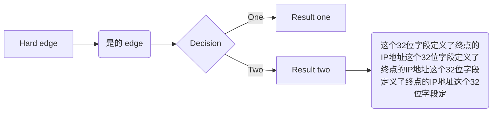

## IPV4

### 一、简介
**网际协议**（Internet Protocol，IP）是TCP/IP协议族在网络层使用的传输机制。

IP是一种不可靠的无连接数据报协议—  一种**尽最大努力交付**（best-effort delivery）的服务。尽最大努力一词的意思是IP分组有可能损坏、丢失、失序或延迟到达，并且有可能会给网络带来拥塞。

如果可靠性很重要，那么IP就必须与可靠的协议（如TCP）配合起来使用。理解尽最大努力服务的一个日常生活中的例子就是邮政局。邮政局尽最大努力交付邮件，但并不总是能够成功。如果一封非挂号信丢失了，那只能由发信人或预期的收信人来发现信件的丢失，并采用补救措施。邮政局本身并不对每一封信进行跟踪，也不通知发信人有关信件的丢失或损坏情况。

### 二、数据报
网络（互联网）层的分组称为数据报（datagram）。图7.2给出了IP数据报的格式。数据报是一个可变长度的分组，它由两部分组成：首部和数据。首部的长度可以是20~60字节，包含有关路由选择和交付的重要信息。习惯上，在TCP/IP中都是以4个字节为一段来表示首部。下面按顺序简单地介绍各个字段。

**版本（VER）** 这个4位字段定义了IP协议的版本。目前的版本是4。但是将来版本6（或IPng）很有可能会取代版本4。这个字段向处理机上运行的IP软件指出该IP数据报使用的是版本4的格式。所有字段都要按照版本4协议所规定的来解释。如果机器使用其他版本的IP，那么这个数据报就会被丢弃，而不是错误地进行解释。

**首部长度（HLEN）**  这个4位字段定义了数据报首部的总长度，以4字节的字为单位计算。这个字段是必要的，因为首部的长度是可变的（在20~60字节之间）。在没有选项时，首部长（header length）是20字节，且这个字段的值是5（5×4=20）。当选项字段为最大值时，这个字段的值是15（15×4=60）。

**服务类型**  在最初设计IP首部时，这个字段称为服务类型（type of service，TOS），它指明了应当如何处理数据报。这个字段中有一部分用于定义数据报的优先级，剩下的一部分定义了服务类型（低时延，高吞吐量等等）。IETF已经改变了这个8位字段的解释，现在它定义了一组区分服务（differentiated services）。

**总长度**  这个16位字段定义了以字节为单位的数据报总长度（首部加上数据）。要找出从上层传送来的数据的长度，可以用总长度减去首部长度。把HLEN字段的值乘以4就可得出首部长度。

			数据长度=总长度-首部长度

因为总长度字段是16位，因此IP数据报长度限制在65535（即2^16-1）字节，其中首部占20~60字节，剩下的是从上层传送来的数据。

**生存时间**  数据报在互联网中的旅程是有生存时间限制的。

**协议**  这个8位字段定义了使用此IP层服务的高层协议。有许多高层协议（诸如TCP，UDP，ICMP和IGMP等）的数据都能够被封装到IP数据报中。这个字段指明IP数据报必须交付给哪个最终目的协议。

**源地址**  这个32位字段定义了源点的IP地址。在IP数据报从源主机发送到目的主机的过程中，这个字段始终保持不变。
**目的地址**  这个32位字段定义了终点的IP地址。在IP数据报从源主机发送到目的主机的。在IP数据报从源主机发送到目的主机的过程中，这个字段始终保持不变。

